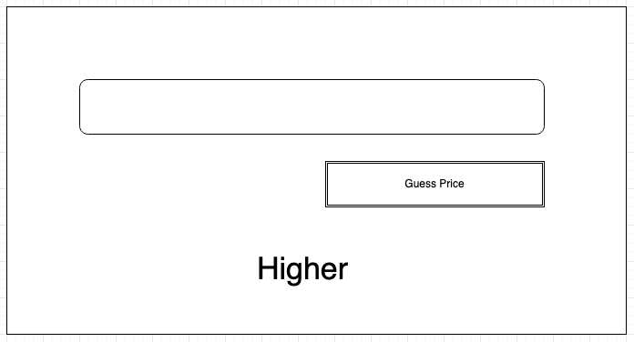

# Training - Higher-lower

Write a program that meets the following requirements:
1. The program generates a random number and stores it in a variable, but does not display it on the screen.
2. User can enter a number.
3. The program displays "Higher" in a label if the number entered by the user is lower than the number stored in step 1, and "Lower" if the user's guess is too high. If the number is guessed correctly, a MessageBox is displayed saying "Guessed!".

## Extension
If you need extra practice with _variables_ in addition to _conditional structures_, then try this case. Expand case 1 with the following functionalities:
1. If the guessed number is too low, the text color of the label turns blue, and if the number is too high, the text color turns red.
2. The program keeps track of and displays in the MessageBox the number of turns the user needed to guess the number: "Guessed in 123 turns!".