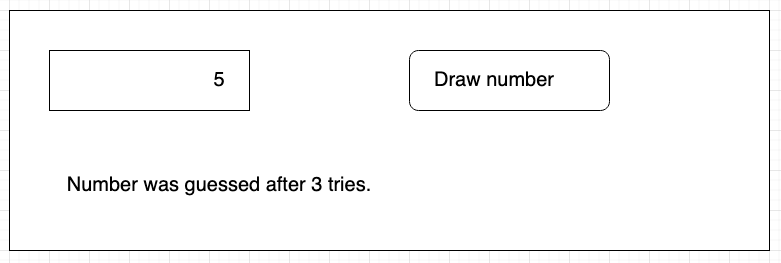

# Training- While - The right number

Have the user enter a number. Verify that it is a number between 0 and 10. After a press, start generating random numbers until you get the user's number. So suppose the number 6 is entered. Then you start generating a random number between 0 and 10. Suppose you draw 3, so you have to start generating again. You keep repeating this until you draw a 6. You show a message to the user: “The correct number has been found after 3 times!”.

