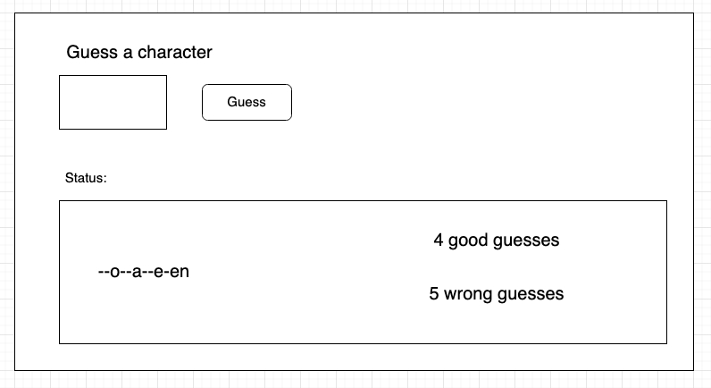

#Training - Gallows

Program the game Galgje where the user has to guess a preset word.

The user gets to guess a letter 10 times. If he then gets the word right then he has won, otherwise the computer wins.

Design ideas: keeps track of the word to guess in one (string) variable and keeps track of all the things the user has guessed in another variable.

## Extensions
1. Create a PictureBox in which you show the number of errors through a number of images of a gallows game and puppet. Dynamically load the next picture each time an error is made. Take a look at the method PictureBox.Load().
2. Show which letters have been. For example, you can show all letters in a black color. Letters that were consulted correctly make them green, letters that were consulted incorrectly make them red.
3. Extension to feature 2: make the (black not chosen) letters clickable. If you click on them, the same event handler is called as under the Submit button.
4. Make sure that when you type a letter it is automatically "submitted", so you don't have to click the button as well. Also, after submitting a letter, empty the TextBox and make sure it always has the focus back immediately so you can type a new letter right away.
5. Make sure you can only type letters in the TextBox. Also accept uppercase letters. There are several ways to solve this. Take a look at this StackOverflow resource where a similar problem is discussed or use a variant of the TextBox called MaskedTextBox. If you do not type a letter, e.g. a number, an error sound will play.
6. Remember the score(s) of a particular player and write them to a highscore file. To do this, have the player identify himself first. Create a highscore summary screen showing all names with the average number of tries required.
7.  Extension to 6: Create a login option where you have to identify yourself with a password to prevent other players from using your highscore. Store this password hashed in the same file where the names and high scores are. Use e.g. MD5 for this. Each line in the file consists of "<username> <md5 password> <highscore>".
	Since MD5 is not secure, try to find another hashing algorithm.