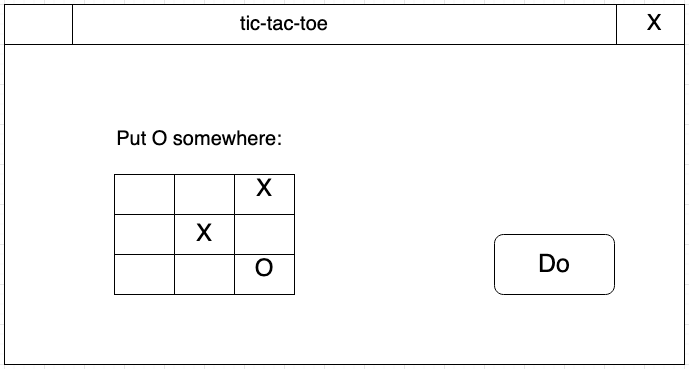

# Training - Butter, cheese and eggs against the computer

First come up with an algorithm (using Flowchart) for butter-cheese-and-eggs. You can set up that algorithm so that someone can play butter-cheese-and-eggs against the computer. Think beforehand about how you are going to program this: which variables do you need and when are you going to give those variables a value?

