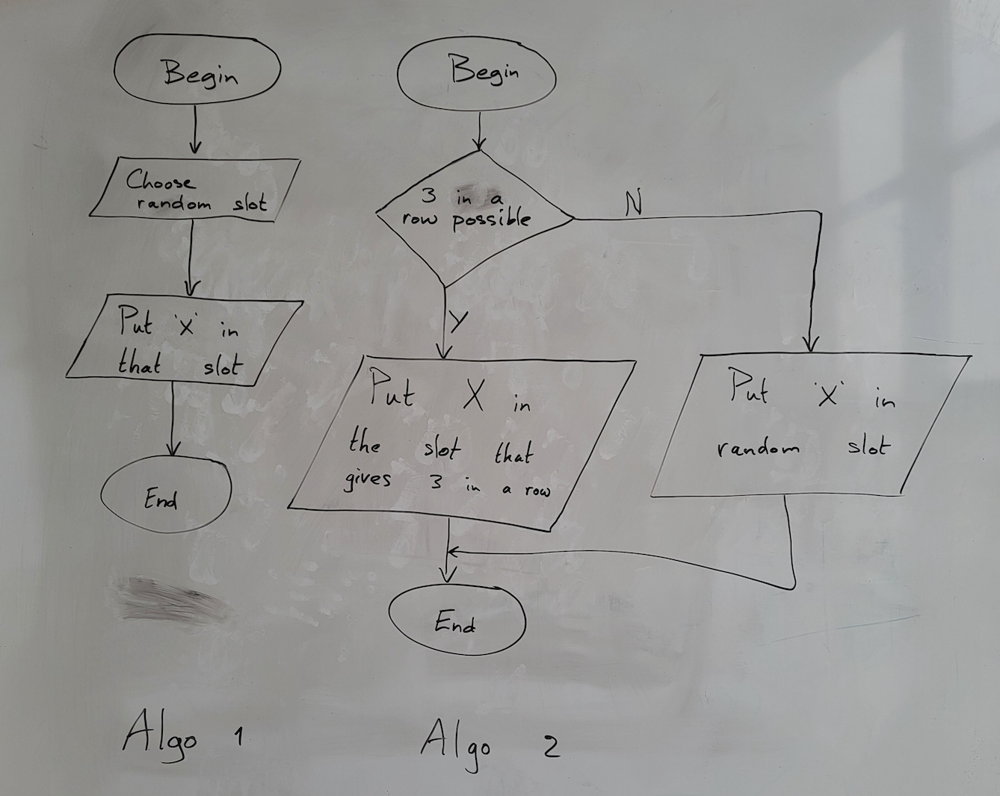

Who beats their opponents most effectively with their algorithm?

![[figures/example.flow.chart.png]]

# Software development

When developing software whether it is for a game, an accounting program, an app for the phone or a website, we distinguish three different steps:

1. Create an algorithm for the program
    
2. Program the algorithm in a programming language
    
3. Test the program and fix any errors
    

In this workshop, we will work on step 1: we will design an algorithm for a computer program. It is an important step because without a properly pre-designed algorithm, a computer program or mobile app can never work properly.

# What is an algorithm?

An algorithm is a roadmap that can be quickly and unambiguously converted into code (programming language) by a programmer.

Important properties of an algorithm:

- It is finite. It stops after a certain number of steps.
    
- The initial situation is clearly defined. For example, the game situation at the time a
    
    player's turn.
    
- Possible end situations are clear. The outcome of the algorithm is clear.
    
    A good algorithm produces the best possible result with as little work as possible.

# How do you create an algorithm?

One possible representation of an algorithm is a so-called flow chart. Such a flow chart or flow diagram consists of the following parts:

[wikipedia: Flowchart](https://en.wikipedia.org/wiki/Flowchart)

# Example algorithm for tac-tac-toe

For tic-tac-toe, an algorithm can be devised for one round of play. We assume that this is player "X," but for player "O" such an algorithm would look the same.

The initial situation is: it is the player's turn (the playing field is empty or already partially filled).

The final situation is: the player has placed his mark (cross or round) in an empty square OR the game is lost/won/drawn.

Two different algorithms are (in Dutch): 
See if you can understand what they mean: 

The first algorithm puts a cross in just any empty box. This one is not very clever, but the final situation is always correct: at least something is checked.

The second algorithm first checks per empty box whether the player "X" can win by checking that box, if not he checks a random box. That algorithm is already a bit smarter.

# Task 1

Goal: design a good and winning algorithm for butter-cheese-and-eggs. You first work together in pairs and later together in a team of 4.

1) 30 minutes: In pairs, create an algorithm for butter-cheese-and-eggs that is better than the above example algorithms. Check that your algorithm meets the following requirements:

- It is built from the building blocks described above.
    
- It is an algorithm for one game turn (i.e., during a game, each player performs every
    
    turns executing his algorithm until one player has three-in-a-row).
    
- When the algorithm is executed, one empty square is always chosen to place a cross or round
    
    (depending on which player you are), if necessary your algorithm chooses a random square.

- The meaning of the text in the created algorithm should be clear and unambiguous (e.g., clear/unambiguous is "Can a row of three crosses be made horizontally, vertically or diagonally in a row?", not clear/unambiguous is e.g., "Put a cross in the best place").
    
- The algorithm has one clear starting point and one clear ending point.
    
- It is impossible to "linger" infinitely in the algorithm.

# Task 2 - The guru algorithm.

10 minutes: Within your group, play as many games of butter-cheese-and-eggs against each other as possible according to your algorithm (otherwise it is cheating!) starting the game alternately. Remember (briefly write down) how many games each player won. Try to find out in which cases your algorithm works well and in which cases you may not have anticipated. If your group has an odd number of group members you will have to rotate per game.
    
Optimize your algorithm based on your findings during play, and possibly test your revamped algorithm by playing against another group member.
    
30 minutes: As a group, create your guru algorithm: the "ultimate" algorithm where you combine the cleverness from the individual algorithms. Create your guru-algortime on a new sheet of paper.

# Task 3 - Competition
    
Someone draws a league on the board in which each team plays against every other team twice (once as a starter, once that the other starts) and once against themselves. Complete the following diagram in class (on the whiteboard or digitally).
    
 NOTE: Both teams provide their algorithm, but one person from the other team must run the algorithm each time.
    
 If it says anywhere that a character is in a random spot, a random spot is actually chosen with a 9-sided die (e.g. http://dice.virtuworld.net/ ).

![[Screenshot 2024-05-22 at 21.54.35.png]]

