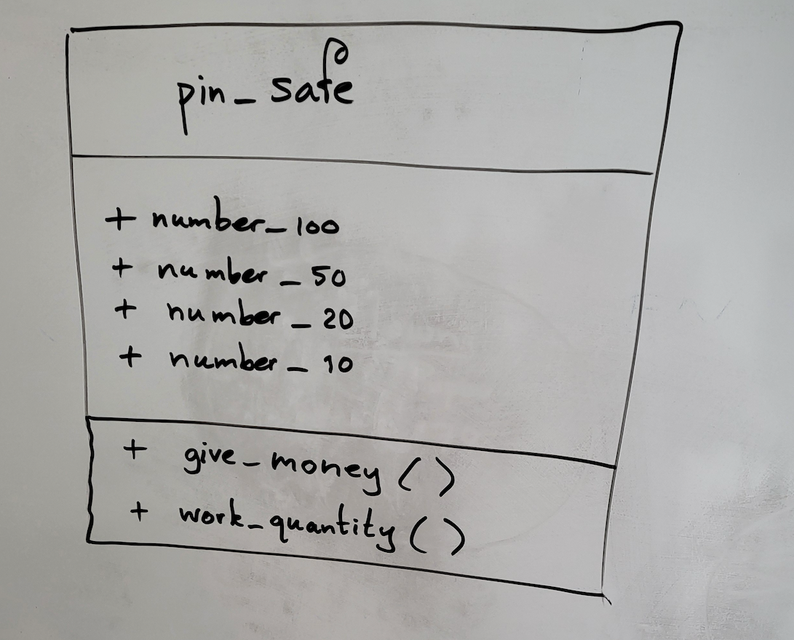

# Example OOP: ATM

As an example of Object Oriented Programming, the automation of an ATM is discussed here.

## Object

With the ATM, you have to deal with a number of `objects`, which are the things that perform certain actions.
For example, you have the *PinCustomer*. He or she will have an *Account* at a certain *Bank*, and a *PinPas*, otherwise he or she cannot *PinPin*. Therefore, from now on, we will call the *PinCustomer* an *AccountHolder*. That is the first `object`.

Then we have the *PinAutomate* itself, which is also an `object`. Then there is an `object`, which contains the money that can be PINed. We call that the *PinMoney Safe*. That object will probably be very close to the ATM, but we will assume it is a separate object anyway.
And of course, when withdrawing money, the *Bank's database* will have to be consulted, which can also be called an object.

## Class and instance

There are, of course, a lot of account holders. The collective name for all those account holders is a `Class`.
If you have a particular account holder, for example Mr. R.J. van der Beek, that is an `object` or also called `instance of a class`.

The `compound name` for all *pin money vaults* is the class *Pin Money Vault*: in `class` *Pin Money Vault* are programmed the properties and behavior of all `objects` of the `type` *Pin Money Vault*.

If you take the pin money safe of the ATM of the *Frieslandbank* in *Buitenpost* as an example, it is an `object`. It is also called an `instance` (`instance`) of the class pin money vault. The terms `instance` and `object` are used interchangeably.

## Attribute

In that pin money safe of the ATM of the Frieslandbank in Buitenpost there is a certain amount of banknotes. There are perhaps 200 *notes* of 100 euros in it, and perhaps also 200 *notes* of 50 euros, and some *notes* of 20 euros and some *notes* of 10 euros.

Those numbers are called the `attributes` (~`attributes`) of the class Pin Money Safe. And the pin money safe probably also contains a *chip* with *memory locations*, in which those numbers are recorded.
## Operation

Of course, those numbers change all the time, and in the memory locations, those changes must also be tracked.
If 200 euros has been PINed (4 times 50 euros) then the number of 50s must be reduced by 4. The *program part* that takes care of that is called an `operation` (~operation) or `method`. So a `class` also contains a number of `methods`.

There is a `method` that we call here "*WorkAt*". And that 200 euros must then be put in the drawer of the ATM, the method that takes care of that we call "*GiveMoney*".

You often see that the names of methods are verbs and those of attributes are often nouns (names of classes are also nouns).

In whatever language you program, often the (technical) design is modeled according to unified modeling conventions: in *UML*, or *Unified Modeling Language*.
In an `UML class diagram, classes are represented by rectangles, with a box at the top containing the name of the class.
The attributes and operations of the class are represented in two other boxes within the rectangle, the attributes in the middle box and the operations in the bottom box.

From the pin project you can see a possible `class diagram` below. There you see that classes also exist without attributes .

## Object Oriented

In UML, things, which happen, are usually described as `sending messages by objects`, and performing operations (or methods) by the objects.
When the account holder R.J. vd Beek inserts his debit card into the ATM, that event is described in UML as: *the object R.J. vd Beek sends the following message to the ATM: check my debit card.*

The ATM then executes the operation (method) "*ReadPassNumber*".
It then sends a signal to the computer connected to it to check the card number in the database.
That event is described in UML as: *the object pin device sends the following message to the object computer: check the pass number*.

The basic idea of `OOP` is that the world consists of `objects` that communicate with each other by sending each other `messages`. In languages such as C#, this is implemented by objects calling methods of each other.
