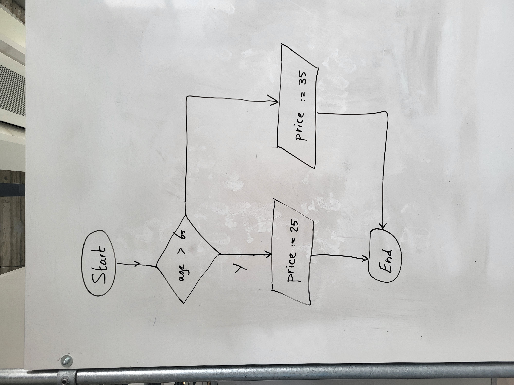
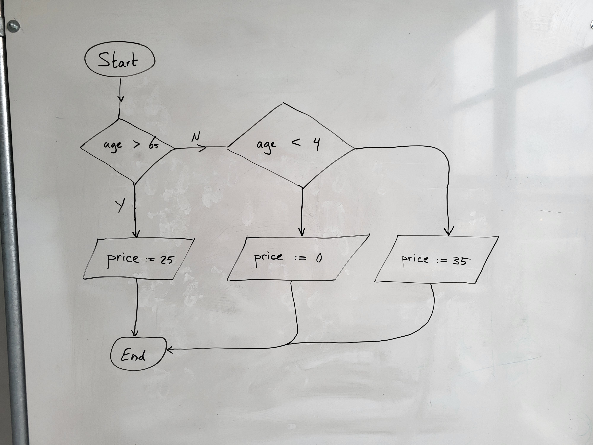
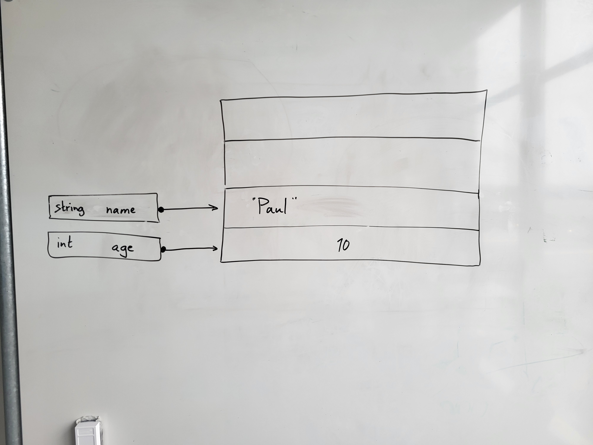
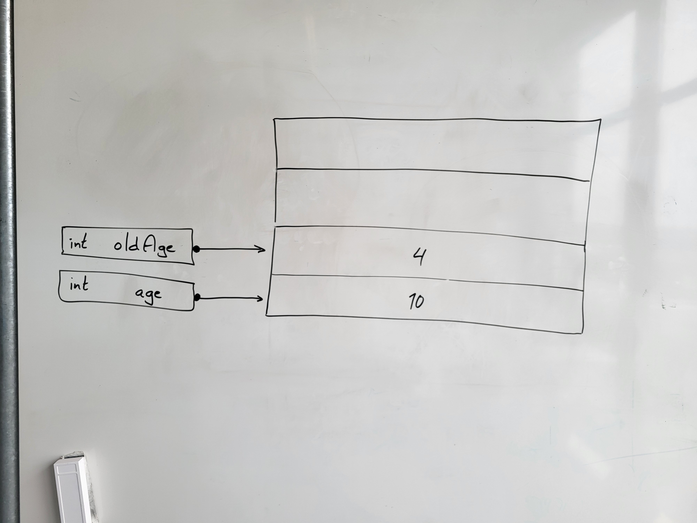
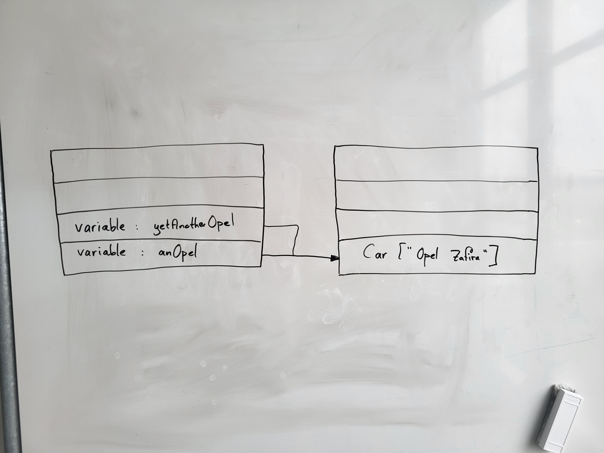

# So you wanna be a Software Engineer?

Suppose you have
the taste of *programming* and
want to learn more about *Software Engineering*.
In this *part* some topics that
not (extensively) discussed before
but are also important. This piece of text mainly comes off from instructor Alexander.


## Backgrounds to Software Engineering: Introduction
Some important concepts
- Accessibility: internal and public for classes, public, protected, private
for functions.
- Inheritance, including abstract classes abstract and virtual functions,
override of functions, calling base constructor
- Interfacing - why do we know that concept and why use it
- Exception handling - when is something an error and when is acceptable behavior
with an unexpected result.
- Events


## Basic concepts of programming

Programming in an (object-oriented) language uses a number of basic concepts
that are the same for every language and differ only in the way
you write them down. These basic concepts can be divided into roughly three categories:

### 1. Statements
A command that is executed unconditionally. For example, assigning a variable or calling a function.

### 2. Choice structures
A (number of) statement(s) which is executed only if a certain condition is met.

### 3. Repeat structures
A (number of) statement(s) which is executed multiple times, possibly also under certain conditions.

We will now look at all three categories in more detail.

## 1. Statements
A statement is the most basic concept in programming. With a statement
is used to execute a command in the program. You can think of
of declaring a variable, assigning a value to a variable and
and calling a method. In code, statements look like this
look like:

```cs
int i = 4;
int j = 5;
int outcome = CalculateProduct(i, j);
```

## 2. Choice structures (if-statements).

As the name implies, choice structures involve making a
choice of whether or not to execute a particular piece of code, depending on a
certain condition. Usually, a choice structure consists of 2 parts: The code that
is executed if the condition is true and the code that is executed if the
condition is not true. This is shown schematically in




In code, this then looks like this:

```cs
if (age > 65)
{
   price = 25;
}
else
{
   price = 35;
}
```

As an extension to choice structures, there are two more variants.
The first variant is the choice structure, in which code is executed only
if the condition is true. This means that if the condition is not true
is true, no more action is performed and thus immediately goes to 'End'.
is executed. In code, this means that the 'else' construction can be omitted.
The second variant is a bit more complex and contains multiple choices that are executed
being executed. This means that in Figure 2.1 an additional choice is added on the side of
the 'no' and a choice is made in it again. This looks schematically
then as follows:





As can be seen in the diagram, any adjustment to the price in this example,
can only be performed under one condition: The price becomes 25 if the age is above
the 65, the price becomes 0 if the age is NOT above 65 but under
4, and in all other cases the price becomes 35.
An "else if" is then added in the code:

```cs
if (age > 65)
{
   price = 25;
}
else if (age < 4)
{
   price = 0;
}
else
{
   price = 35;
}
```

## 3. Repetition structures (loops).

If certain statements have to be executed several times in a row,
repeating structures (loops) are used.
are used. Conceptually, there are three variants of the repetition structure:
condition-based, number-based and list-based.
Depending on which way the code needs to be executed multiple times,
choose one of the methods below.

#### Condition-based structure (while)


It is common for code to be executed as long as a certain
condition is met. For example, suppose you need to increment a number by 5 until
this number exceeds 100, you use a condition-based
structure.
In code, this looks like this:

```cs
int i = 1;
while (i < 100)
{
   i = i + 5;
}
```
If the condition is false the first time, then the code within the
while is not executed. An alternative to this variant is the do-while construction.
With the do-while, the code is executed until the condition is no longer true
and thus the code is always executed at least once. The code for this looks
as follows:

```cs
int i = 1;
do
{
   i = i + 5;
} while (i < 100)
```

#### Number-based structure (for)

Another structure that is common is to execute for a fixed number of times
of the same code. Consider the display of the table
of 10. It is clear in advance that the display of the value must take place exactly 10 times
must take place and this number will not change. This can be solved with
the condition-based structure, but in (almost) all programming languages there is
a special construction for this: the for-repetition structure. In code, this looks
as follows:

```cs
for (int i = 0; i < 10; i++)
{
   Console.WriteLine(i * 10);
}
```

The first line consists of 3 parts:
- int i = 0: The starting value of the counter
- i &lt; 10: The condition that tells what the final value of the counter is, in other words: as long as this condition is not true, the code is executed.
- i++: The increment of the counter.

The above code could also be written as a while loop, by
putting the start value above the while, and including the increment as the last statement
within the loop. You then get a similar structure to the one
that shown in Figure 2.3.

#### List-based structure (foreach)

If you want to perform an action on all elements of a list, you can use
use a for loop where the condition for the final value contains the number of
elements in the list. Most languages also offer a specific
structure for this: the foreach loop. In code, this looks like this:

```cs
List<Person> persons = GetAllPersonsOn();
foreach(Person person in persons)
{
   Console.WriteLine(person.Name);
}
```

You can see that in this structure you don't have to explicitly specify how many iterations
are going to be executed, and you have the instance of the Person immediately
available.

## Variables

### Scope

Every variable has a scope. The scope of a variable indicates when
the variable exists. For example, consider the following code:

```cs
int i = 1;
if (i == 1)
{
   int j = i;
   j = j * 2;
}
i = i + 1;
```

From the moment the variable i is created, it exists and
continues to exist throughout this piece of code and thus can be used within and after the if statement
used. For the variable j, this is different. The variable j is created within
the scope of the if statement, so this variable can only be used
within the if statement. After the closing brace of
the if statement, the variable j can no longer be used. The compiler
recognizes this and will give an error message if you try to use a variable outside its scope.
scope.
Scoping is known at a number of levels:
- A variable declared within a structure (repeat or choice structure) can only be used within that structure.
- A variable declared within a method can only be used within that method.
- A variable declared within a class (for example, a property or private field) can be used as long as the instance of a class exists.
- A variable declared static in a class can always be used.

### Types

In programming, we talk about the type of a variable when we mean
what data and functionality the variable can contain. For example
an `int` (integer) for integers, string for text and File for a file.
You can also add new types yourself by defining a `class'.
In object-oriented languages, we distinguish two types:
+ **Primitive types**: As the name implies, primitive types are the most
basic version of variables. Here you can think of int and decimal to store
numbers, bool to store true or false, and char to store a letter in
a letter. Therefore, this is all you do with these types.
+ **Object types**: Object types (or sometimes called complex types) are
types that are used to model more complex behavior. In these
types, in addition to values, behaviors can also be encoded. In OO languages
these types are created by defining a new Class and providing it with an
implementation.
+ **Exception: String**: Strings are an oddity within OO languages.
the crop. Actually, a string is an object (namely: a collection of letters of
type char in a specific order). However: in practice, this is usually
not useful at all. Therefore, in a number of OO languages, the string is a hybrid
form. In C#, for example, the string is applied as a primitive type when
you store strings, but as an object when you use string functionalities such as
Split, Replace and Substring.

### Value types versus Reference types

We looked at primitive types versus object types in the previous section.
The difference between these types leads to an important difference in OOprogramming
between these types: All primitive types are value types and all
object types are reference types. In this case, the String falls under the primitive
types.

#### How does a value type work?

When you declare a primitive type in code (for example, `int age =
4` ), then a piece of memory is reserved in which this value is
stored. The variable age then refers to this piece of memory, in which
the integer value 4 is stored. This has several implications:

- Only an integer is allowed in this piece of memory. So you cannot assign strings, comma numbers or objects to it.
- This piece of memory is available only for the variable age. There is no other variable that refers to the same piece of memory, so an adjustment of the value can only be done through an adjustment of the variable age.
- When the variable age no longer exists, the memory is released again.

Suppose you have the following code:

```cs
int age = 4;
string name = "Paul"
```

Then the memory at that point looks like:





Another aspect of value types is assigning one variable to
another (for example, int oldLife = age). When this is executed,
a copy of the value in age is made in memory and
this is assigned to oldAge. This means, then, that if you subsequently modify the
value of age, the value of oldAge does NOT change with it.
So suppose you run the following code:

```cs
int age = 4;
int oldAge = age;
age = 10;
```

Then, after executing the code, the memory looks like in figure




#### How does a reference type work?

When you declare a reference type you do so with the keyword *new*. At
that moment, not one, but two pieces of memory are reserved:
In one piece of memory the content of the variable is stored and in the other
piece of memory a reference to this content is stored. So suppose that
you execute the following code:

```cs
Auto opel = new Auto("Opel Zafira");
```

then the memory looks like in


As you can see, there are 2 pieces of memory reserved, in different parts
of memory.
Also, assigning one variable to another works differently with reference
types works differently. When you assign one variable to another, one
extra piece of memory is reserved, in which a reference to the already existing
contents of is stored. So suppose you have the following code:

```cs
Auto opel = new Auto("Opel Zafira");
Car stillAnOpel = Opel;
```

Then the memory looks like in figure




As a result, if you change the name of the car via the variable
*opel* ( `opel.Name = 'Opel Corsa'` ), it is also immediately updated when you retrieve the name
retrieved via *AnyOpel*.

This also applies to parameters in functions.

#### Tips for typing variables

A rule of thumb for knowing whether something is a value or reference type is to
look at the declaration of the variable:
-If the variable is assigned by directly attaching a value to it
( `int i = 4` ), then it is a value type.
-Whether the variable is assigned by using new
( `Auto auto = new Auto()` ), then it is a reference type.

## OO techniques

### Inheritance: How this works in memory

The theory of object-oriented programming deals with *inheritance* (derived
classes) and *interfacing*. This chapter covers how inheritance works in memory and thus provides a background on inheritance as a concept.


An example of a *class diagram* that uses *inheritance*. If you have implemented this class diagram, then you can use all these classes to create objects with. Suppose you write the following code:

```cs
Motorboat yamaha = new Motorboat();
```

A piece of memory is then reserved in which this Motorboat is
stored (in the manner described in section 3.3). The piece of memory
where the object is stored contains all the data from Motorboat (number of HP),
all data from Boat (name) and everything from IV Vehicle (registration number). The
type of the variable indicates which of these data you are allowed to access. In the case
of Motorboat this means that you can access all data.
Now suppose you have the following code:

```cs
Motorboat yamaha = new Motorboat();
Boat boat = yamaha;
IVvehicle vehicle = yamaha;
```

There is now a piece of memory reserved in which the Motorboat is stored.
The variable yamaha contains a reference to this piece of memory. The line of code
in which the boat variable is created contains a reference to the same
piece of memory as the motorboat, but if you use the variable boat you cannot
you can no longer access the number of HP. The same goes for the variable vehicle: you
can now only access the Registration number, even though the reference is to the piece of
memory is where all the data is.

#### Restrictions

In the Motorboat example, a motorboat was created, then used as Boat and IV Vehicle. You cannot do this the other way around. Thus, the following code will not compile:

```cs
Boat boat = new Boat();
Engine boat yamaha = boat;
```

The reason is that the reserved memory contains the data of
Boat and IV Vehicle, but not Motorboat. If you then
access that memory as Motorboat there should be a piece of memory in which
the number of HP is stored, but this is not there.
What is also not possible is the following:

```cs
Boot boot = new Boot();
Auto auto = boot;
```
Here is about the same: In memory, IV Vehicle and Boot are available,
but not Auto. Because of this, it is not possible to access the memory
as if it were a car.


### Software Architecture

See site:

[http://aosabook.org/en/index.html](http://aosabook.org/en/index.html)
