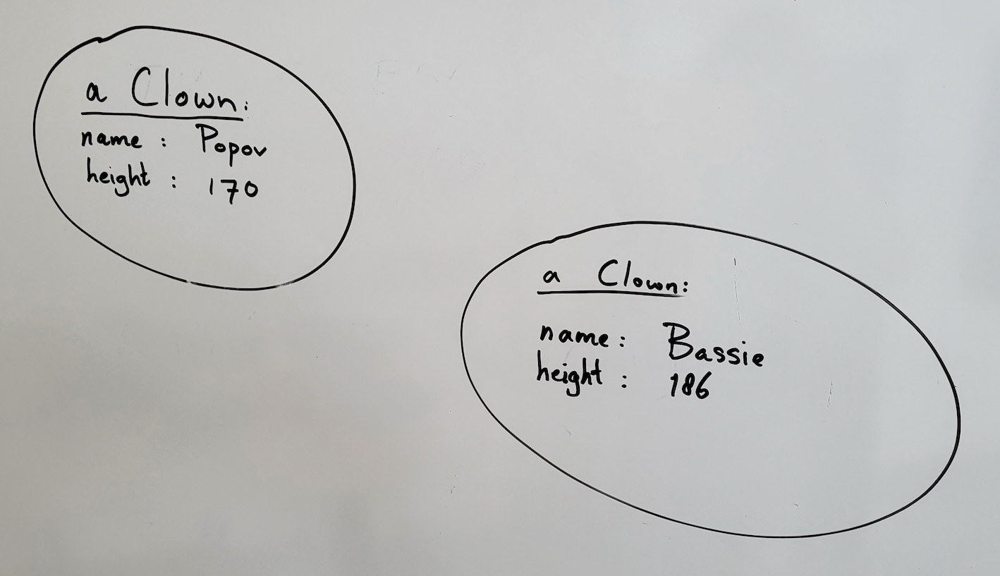

# Constructor

What exactly happens behind the scenes when you create an object with new?

The statement `new Clown()` is intended to create a new object from the class `Clown`. The statement calls the so-called `constructor`. A constructor looks like a `method`, but it's not a regular method.  

How to recognize a constructor in C# code:
+ Constructor always has exactly the same name as the class.
+ Constructor has no return type and also no void in front of it.

If you create a new class it will look like this:

```cs
public class Clown
{

}
```

Hey, but where is this `constructor` then? Well, what actually happens behind the scenes: when the compiler translates a class that has no constructor, it implicitly creates a very simple one, called a `default constructor`. The compiler pretends that it says this:

```cs
public class Clown
{
   public Clown()
   {
   }
}
```

This might seem redundant, but we can give a constructor parameters: just like with methods.

```cs
public class Clown
{
   // Fields <-- Fields we make private!
   private string name;
   private int height;

   // constructors
   public Clown(string name, int height)
   {
      this.name = name;    // the word 'this' indicates
                          // that the Field 'name' is meant.  
                          // the 'name' after the equals sign is the parameter.
      this.height = height;
   }

   // methods
   public string TalkAboutYourself()
   {
      return "My name is " + this.name
               + " and I'm " + this.height + " centimeters tall.";
   }
}
```

The constructor parameters make it possible to immediately assign a name and height when creating an object of type Clown:

```cs
Clown aClown = new Clown("Popov", 170);
Clown otherClown = new Clown("Bassie", 186);
```

So we then have 2 objects of type Clown, shown here schematically:



In practice, programmers often work with `class diagrams`, as shown in the example below. Usually class diagrams have multiple classes.


A class is represented as a rectangle consisting of 3 parts:
1. at the top is the **name of the class**.
2. Then follows the **data**, here the Fields in which values can be stored: name and height.
3. At the bottom is the **behavior**: here the constructor and the method that Clown has.

Note that the types are after the name: so `name: string` instead of what we are used to in C#: `string name`.

As you can see in the code in the class above: between `public` and `Clown()` there is no return type, furthermore the name `Clown` is the same as the name of the class: that is how we know it is a constructor.

Note: code belongs in classes, not in forms!

## What is constructor overloading?

*Constructor overloading* means that multiple constructors exist within a class.
You can then create objects in different ways.

For example: if you know the height of a Clown you give it, otherwise you do not:

```cs
Clown oneClown = new Clown("Popov");
Clown otherClown = new Clown("Bassie", 186);
```

From the number of parameters and their type, the compiler then sees which constructor to execute:

```cs
public class Clown
{
   // Fields <-- Fields we make private!
   private string name;
   private int height;

   // constructors
   public Clown(string name, int height)
   {
      this.name = name;
      this.height = height;
   }

   public Clown(string name)
   {
      this.name = name;
      this.height = 175; // THIS IS NOT QUITE AS WE WANT! Read on!!!
   }

   // methods
   public string TalkAboutYourself()
   {
      return "My name is " + this.name
               + " and I'm " + this.height + " centimeters tall.";
   }
}
```

You can see that a Clown whose height we do not specify in this code is given the height 175.

The above code contains something else we don't really want: you can see that the code of the constructors is very similar. We can optimize the constructor code:

```cs
   // constructors
   public Clown(string name, int height)
   {
      this.name = name;
      this.height = height;
   }

   public Clown(string name) : this(name, 175)
   {
   }
```

When the second constructor is called, it says: `this(name, 175)`: that means: call from `this` (myself) the constructor that expects as parameters a string and an int: use the value of `name` and for the height: `175`.

Can you think of an advantage of this `this` construction?

## Magic Numbers
By the way, we don't want hard-coded numbers in code, we call those `magic numbers`: no idea where they come from and what they mean. For example, it is better practice to create a `constant`, give it a clear name, and use it:

```cs
// https://en.wikipedia.org/wiki/Average_human_height_by_country
public const int averagePersonHeight = 175;
```

Thus, from the call `.... : this(name,averagePersonHeight)` suddenly becomes clearer what it means.

You can also see that in comments a source is mentioned! That makes it possible to check, validate and possibly improve it:
+ Is this a global average or a Dutch number (Popov is a Russian).
+ In the table there is a separate column for men and women: did the programmer take that into account?
+ In a few years it will be possible to look back to see if the values may have changed.

See [microsoft docs: constants](https://docs.microsoft.com/en-us/dotnet/csharp/programming-guide/classes-and-structs/constants)

## Relevant trainings.
Invaders and Gallows.