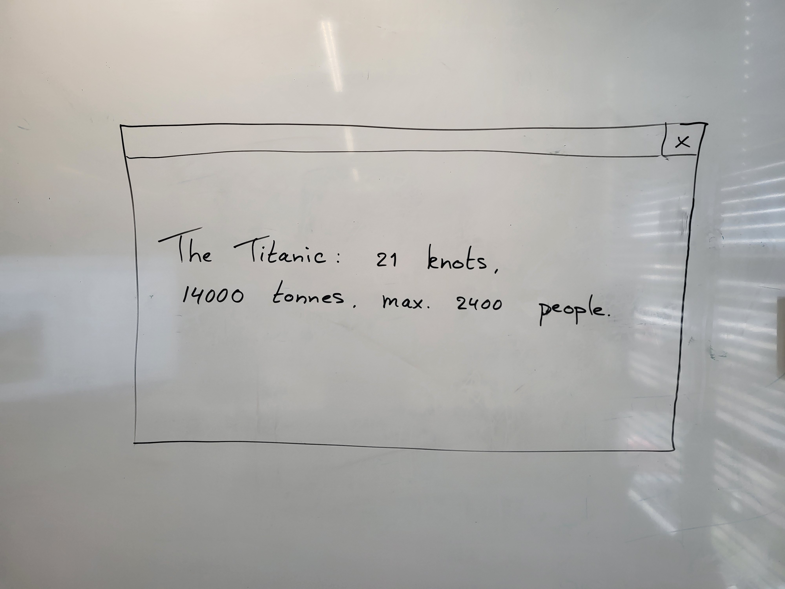
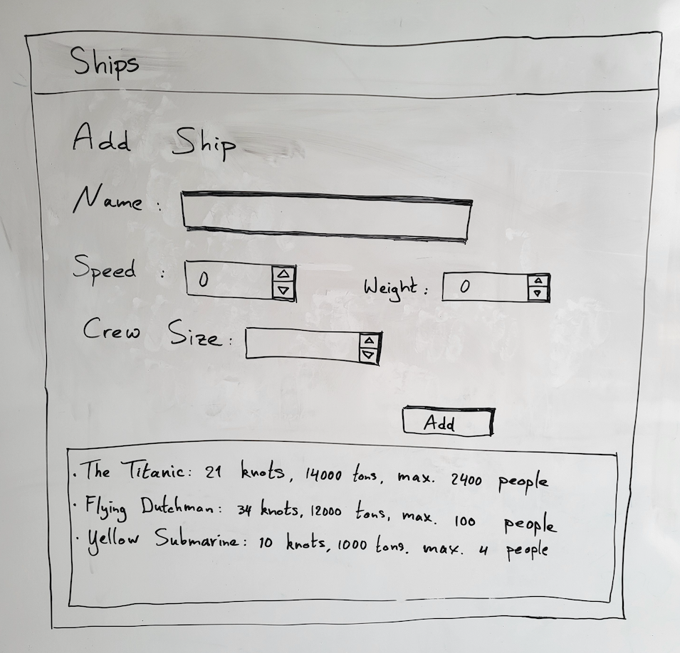

## Your object as a string: override ToString()


Sometimes you want to represent the *instance* (that is, the *object*) you created from your own class as a string. For example, to put in a ListBox. Fortunately, C# has come up with the 'ToString' method for that. Every class has this method. Try it out.

```cs
Boot b = new Boot();
string bootString = b.ToString();
MessageBox.Show(bootString);
```

As you can already see in the screenshot on the right side of the page, this is not very useful yet. This is what the default ToString method does to your class. Fortunately, we can give it a more useful definition ourselves. Take a look at the piece of code below.

```cs
public override string ToString()
{
   StringBuilder sb = new StringBuilder();
   sb.AppendFormat("{0}: {1} knots, {2} tons, max {3} man.",
   Name, Speed, Weight, NumberScrew);
   return sb.ToString();
}
```

Here you can see a 'ToString method' that will display some more data about the boat. This can also be seen in the screenshot below. You can just copy-paste this ToString method into your Boot class. After you have done that you can use the new ToString method and try it out.





Note that you also include the `override` keyword in the method definition. With that, C# knows you want to rewrite the standard ToString method. That one wasn't very useful anyway. So your own interpretation is probably better.

The ToString method is also useful for another reason. Namely, C# uses it in the representation of your objects. See what happened in the following example.


```cs
Boot b = new Boot();
...
lbBoats.Items.Add(b);
```

The moment you add a boat to the ListBox, C# will call the ToString method for you and use it in the representation. The ListBox itself contains the entire instance, not just the string. Pretty handy, in other words!

Start working with the ToString method yourself and try it out in different classes you have created. Can you then put it in a ListBox as well?




